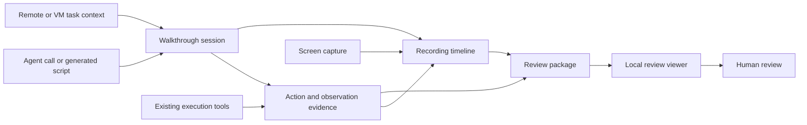

# Architecture

The design wraps existing execution tools and binds their evidence to a reviewable recording. [Owner decisions](../decisions.md) constrain the subsystems; [engineering](../engineering/CLAUDE.md) defines their execution mechanisms.

## Subsystem walkthrough

## Specifications

| Document | Responsibility |
| --- | --- |
| [Design philosophy](design-philosophy.md) | Principles binding every subsystem. |
| [Sessions](sessions.md) | Task, step, attempt, capture, and handoff lifecycle. |
| [Action and observation evidence](action-evidence.md) | What an operation or observation establishes and how annotations reference it. |
| [Recording timeline](timeline.md) | Time relationships, uncertainty, and segment boundaries. |
| [Review package](review-package.md) | Durable delivery and independent review outcomes. |
| [Data schema](data-schema.md) | Shared record identities and relationships. |
